VUEjs v2 PDF viewer based on Mozilla's PDFJS.

[](https://www.jsdelivr.com/package/npm/vue-pdf-app)

[](https://badge.fury.io/js/vue-pdf-app)

100% PDFJS functionality:

- zoom
- open
- print
- download
- rotate
- text selection
- search panel
- pdf document password
- thumbnail, outline, attachments, annotation layers

Easily localized configurable toolbar

<sup style="color: red">NEW</sup> Toolbar custom UI

Cross-browser support (including IE11)

Color customization (IE11 not supported)

Buttons icons customization

Light/dark themes

Built-in typescript support

UMD/Unpkg support:

| File                   | Size                               | Gzipped    |
| ---------------------- | ---------------------------------- | ---------- |
| vue-pdf-app.umd.min.js | 1742.89 KiB                        | 478.86 KiB |
| vue-pdf-app.umd.js     | 3115.59 KiB                        | 677.87 KiB |
| vue-pdf-app.common.js  | 3115.12 KiB                        | 677.71 KiB |
| icons/main.css         | 15 - 40 KiB (depends from browser) |            |

# Example

```vue
<template>
  <vue-pdf-app pdf="http://example.com/sample.pdf"></vue-pdf-app>
</template>

<script>
import VuePdfApp from "vue-pdf-app";
// import this to use default icons for buttons
import "vue-pdf-app/dist/icons/main.css";

export default {
  components: {
    VuePdfApp
  }
};
</script>
```

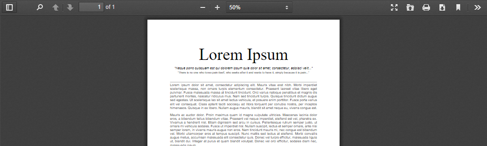

[Live demo](https://codesandbox.io/s/vue-2-vue-pdf-app-wz5kv)

[Live demo 2](https://codepen.io/sandanat/pen/xxVdgYM)

[Examples source code](https://github.com/sandanat/vue-pdf-app/tree/master/examples "Examples source code")

[FAQ](https://github.com/sandanat/vue-pdf-app/blob/master/FAQ.md)

# API

## :pdf

- Type: `string | null | ArrayBuffer | TypedArray`
- Required: `false`
- Usage:

```vue
<vue-pdf-app pdf="https://example.com/sample.pdf" />
<vue-pdf-app :pdf="ArrayBuffer" />
```

## :title

- Description: `true` renames document title to pdf file name.
- Type: `boolean`
- Required: `false`
- Default: `false`
- Usage:

```vue
<vue-pdf-app :title="true" />
```

## :theme.sync

- Type: `"dark" | "light"`
- Required: `false`
- Usage:

```vue
<vue-pdf-app theme="dark" />
<vue-pdf-app :theme="theme" />
<vue-pdf-app :theme.sync="theme" />
```

## <sup style="color: red">new</sup> :fileName

- Description: when pdf is passed like an array buffer default download file name is `document.pdf`. Set this prop to override it.
- Type: `string`
- Required: `false`
- Usage:

```vue
<vue-pdf-app :pdf="ArrayBuffer" file-name="file name" />
```

## <sup style="color: red">new</sup> :pageScale

- Description: default page scale.
- Type: `number | "page-actual"| "page-width"| "page-height"| "page-fit"| "auto"`
- Required: `false`
- Usage:

```vue
// 20%
<vue-pdf-app page-scale="20" />
<vue-pdf-app :page-scale="20" />
<vue-pdf-app :page-scale="page-actual" />
```

## <sup style="color: red">new</sup> :pageNumber

- Description: pdfjs stores last viewed page of a file in `window.localStorage.getItem("pdfjs.history")`. Specify the prop to override it.
- Type: `number`
- Required: `false`
- Usage:

```vue
<vue-pdf-app :page-number="1" />
```

## :config

- Description: toolbar configuration. Toolbar is available by default. Specify `false` for buttons or whole group of buttons to disable them.
- Type: `toolbar config (see below)`
- Required: `false`
- Default: `toolbar config`
- Usage:

```vue
<vue-pdf-app :config="config" />

<script>
export default {
  data() {
    return {
      // disable "Previous page" button
      config: {
        toolbar: {
          toolbarViewerLeft: {
            previous: false
          }
        }
      },

      // disable whole page navigation panel
      config2: {
        toolbar: {
          toolbarViewerLeft: false
        }
      },

      // disable whole panel
      config3: {
        toolbar: false
      }
    };
  }
};
</script>
```

<details>
<summary>Config specification</summary>

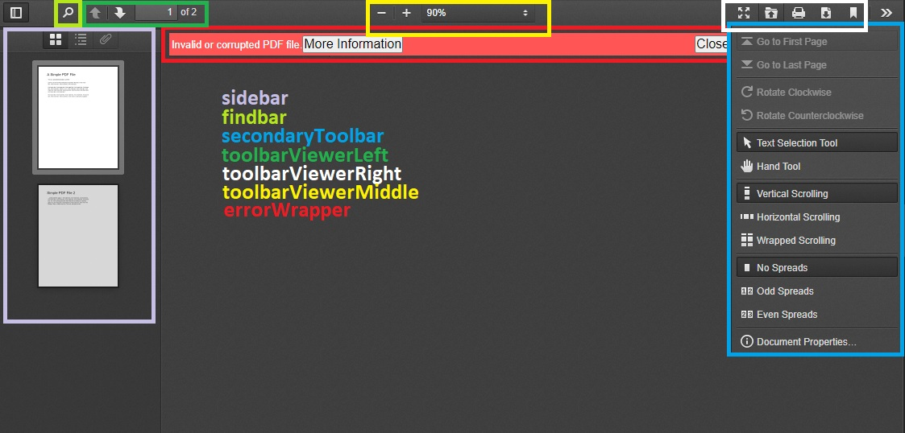

<code>
<pre>
{
  sidebar: {
    viewThumbnail: true,
    viewOutline: true,
    viewAttachments: true,
  },
  secondaryToolbar: {
    secondaryPresentationMode: true,
    secondaryOpenFile: true,
    secondaryPrint: true,
    secondaryDownload: true,
    secondaryViewBookmark: true,
    firstPage: true,
    lastPage: true,
    pageRotateCw: true,
    pageRotateCcw: true,
    cursorSelectTool: true,
    cursorHandTool: true,
    scrollVertical: true,
    scrollHorizontal: true,
    scrollWrapped: true,
    spreadNone: true,
    spreadOdd: true,
    spreadEven: true,
    documentProperties: true,
  },
  toolbar: {
    toolbarViewerLeft: {
      findbar: true,
      previous: true,
      next: true,
      pageNumber: true,
    },
    toolbarViewerRight: {
      presentationMode: true,
      openFile: true,
      print: true,
      download: true,
      viewBookmark: true,
    },
    toolbarViewerMiddle: {
      zoomOut: true,
      zoomIn: true,
      scaleSelectContainer: true,
    },
  },
  errorWrapper: true,
};
</pre>
</code>
</details>

## <sup style="color: red">new</sup> :id-config

- Description: If default toolbar UI doesn't suite you it is possible to build custom toolbar. The prop contains elements ID to which to bind functionality. If element ID is specified in this prop appropriate button will be hidden in a default toolbar. May not work with UI framework components. That is because pdfjs internally manages attributes specific to a certain HTML element (for instance pdfjs toggles `disabled` attribute of a button but it won't if a div is used instead of a button). So it is better to use native HTML element specified as recommended in ID config specification below. Four slots are specially designed to build custom toolbar (are situated near a pdf page): `viewer-header, viewer-prepend, viewer-append, viewer-footer` (refer slots API). It is also possible to use other slots or elements outside vue-pdf-app.
- Type: `ID config (see below)`
- Required: `false`
- Usage:

```vue
<template>
  <div>
    <button :id="idConfig.zoomOut" type="button">Zoom out</button>
    <vue-pdf-app :id-config="idConfig">
      <template #viewer-prepend>
        <div class="viewer-prepend">
          <button :id="idConfig.zoomIn" type="button">Zoom in</button>
        </div>
      </template>
    </vue-pdf-app>
  </div>
</template>

<script>
export default {
  data() {
    return {
      idConfig: { zoomIn: "zoomInId", zoomOut: "zoomOutId" }
    };
  }
};
</script>
```

<details>
<summary>ID config specification</summary>
<code>
<pre>
{

cursorHandTool?: string; // &lt;button&gt; is recommended
cursorSelectTool?: string; // &lt;button&gt; is recommended
documentProperties?: string; // &lt;button&gt; is recommended
download?: string; // &lt;button&gt; is recommended
findbar?: string; // &lt;div&gt; is recommended
findEntireWord?: string; // &lt;input type="checkbox"&gt; is recommended
findHighlightAll?: string; // &lt;input type="checkbox"&gt; is recommended
findMessage?: string; // &lt;span&gt; is recommended
findInput?: string; // &lt;input type="text"&gt; is recommended
findMatchCase?: string; // &lt;input type="checkbox"&gt; is recommended
findNext?: string; // &lt;button&gt; is recommended
findPrevious?: string; // &lt;button&gt; is recommended
findResultsCount?: string; // &lt;span&gt; is recommended
firstPage?: string; // &lt;button&gt; is recommended
lastPage?: string; // &lt;button&gt; is recommended
nextPage?: string; // &lt;button&gt; is recommended
numPages?: string; // total pages qty. &lt;span&gt; is recommended
openFile?: string; // &lt;button&gt; is recommended
pageNumber?: string; // input for page number. &lt;input type="number"&gt; is recommended
pageRotateCcw?: string; // &lt;button&gt; is recommended
pageRotateCw?: string; // &lt;button&gt; is recommended
presentationMode?: string; // &lt;button&gt; is recommended
previousPage?: string; // &lt;button&gt; is recommended
print?: string; // &lt;button&gt; is recommended
scrollHorizontal?: string; // &lt;button&gt; is recommended
scrollVertical?: string; // &lt;button&gt; is recommended
scrollWrapped?: string; // &lt;button&gt; is recommended
sidebarToggle?: string; // &lt;button&gt; is recommended
spreadEven?: string; // &lt;button&gt; is recommended
spreadNone?: string; // &lt;button&gt; is recommended
spreadOdd?: string; // &lt;button&gt; is recommended
toggleFindbar?: string; // &lt;button&gt; is recommended
viewAttachments?: string; // &lt;button&gt; is recommended
viewBookmark?: string; // &lt;a&gt; tag is recommended
viewOutline?: string; // &lt;button&gt; tag is recommended
viewThumbnail?: string; // &lt;button&gt; tag is recommended
zoomIn?: string; // &lt;button&gt; tag is recommended
zoomOut?: string; // &lt;button&gt; tag is recommended
}

</pre>
</code>
</details>

> ℹ️ Note that elements must be in HTML document by the time vue-pdf-app is mounting (use `v-show` instead of `v-if` directive if necessary). Otherwise an error occurs.

## @after-created(PDFViewerApplication)

- Description: emitted only once when Pdfjs library is binded to vue component. Can be used to set Pdfjs config before pdf document opening.
- Arguments:
  - PDFViewerApplication - [pdf application](https://github.com/mozilla/pdf.js/blob/master/web/app.js#L198)
- Usage:

```vue
<vue-pdf-app @after-created="afterCreated" />
```

## @open(PDFViewerApplication)

- Description: emitted when pdf is opened but pages are not rendered.
- Arguments:
  - PDFViewerApplication - [pdf application](https://github.com/mozilla/pdf.js/blob/master/web/app.js#L198)
- Usage:

```vue
<vue-pdf-app @open="openHandler" />
```

## @pages-rendered(PDFViewerApplication)

- Description: emitted when pdf document pages are rendered. Can be used to set default pages scale, for instance.
- Arguments:
  - PDFViewerApplication - [pdf application](https://github.com/mozilla/pdf.js/blob/master/web/app.js#L198)
- Usage:

```vue
<vue-pdf-app @pages-rendered="pagesRendered" />

<script>
export default {
  methods: {
    pagesRendered(pdfApp) {
      setTimeout(() => (pdfApp.pdfViewer.currentScaleValue = "page-height"));
    }
  }
};
</script>
```

> ℹ️ Events are triggered in the following order `after-created (once) => open => pages-rendered`

## Slots

### Slot names

- toolbar-left-prepend
- toolbar-left-append
- toolbar-middle-prepend
- toolbar-middle-append
- toolbar-right-prepend
- toolbar-right-append
- toolbar-sidebar-prepend
- toolbar-sidebar-append
- secondary-toolbar-prepend
- secondary-toolbar-append
- footer
- <sup style="color: red">NEW</sup> viewer-header: slot before `viewer-prepend` slot. Can be used to build custom toolbar.
- <sup style="color: red">NEW</sup> viewer-prepend: slot before `viewerContainer` div. Can be used to build custom toolbar.
- <sup style="color: red">NEW</sup> viewer-append: slot after `viewerContainer` div. Can be used to build custom toolbar.
- <sup style="color: red">NEW</sup> viewer-footer: slot after `viewer-append` slot. Can be used to build custom toolbar.

### Slot props

Each slot has props:

1. toggleTheme

   Type: (): void.

   Description: toggle theme handler

1. <sup style="color: red">NEW</sup> isSidebarHidden

   Type: boolean

   Description: state of a sidebar (visible or hidden). Can be used to manage visibility of custom Attachments, Outline and Thumbnail buttons

1. <sup style="color: red">NEW</sup> isFindbarHidden

   Type: boolean

   Description: state of a findbar (visible or hidden). Can be used to manage visibility of custom findbar

```vue
<vue-pdf-app>
  <template #toolbar-left-prepend="{ toggleTheme }">
    <button @click="toggleTheme" type="button">Toggle theme</button>
  </template>
</vue-pdf-app>
```

# Color customization (IE11 not supported)

Colors of the pdf viewer are customized via custom css properties:

```html
<style>
  /* for dark theme */
  .pdf-app.dark {
    --pdf-toolbar-color: black;
  }

  /* for light theme */
  .pdf-app.light {
    --pdf-toolbar-color: white;
  }
</style>
```

<details>
  <summary>Custom css properties specification</summary>
  <table>
    <tr>
      <th>Property</th>
      <th>Applied to selectors</th>
      <th>Description</th>
    </tr>
    <tr>
      <td>--pdf-app-background-color</td>
      <td>.pdf-app</td>
      <td>Background color for root pdf container</td>
    </tr>
    <tr>
      <td>--pdf-button-hover-font-color</td>
      <td>
        .pdf-app .toolbarButton:hover
        <hr>
        .pdf-app .toolbarButton:focus
        <hr>
        .pdf-app .dropdownToolbarButton:hover
        <hr>
        .pdf-app .secondaryToolbarButton:hover
        <hr>
        .pdf-app .secondaryToolbarButton:focus
        <hr>
      </td>
      <td>Hover color for buttons of toolbar and secondary toolbar</td>
    </tr>
    <tr>
      <td>--pdf-button-toggled-color</td>
      <td>
        .pdf-app .toolbarButton.toggled
        <hr>
        .pdf-app .splitToolbarButton.toggled > .toolbarButton.toggled
        <hr>
        .pdf-app .secondaryToolbarButton.toggled
        <hr>
        .pdf-app .outlineItemToggler:hover
        <hr>
        .pdf-app .outlineItemToggler:hover + a
        <hr>
        .pdf-app .outlineItemToggler:hover ~ .outlineItems
        <hr>
        .pdf-app .outlineItem > a:hover
        <hr>
        .pdf-app .attachmentsItem > button:hover
      </td>
      <td>
        Background color for toggleable buttons when selected, outline items on hover, attachment items on hover
        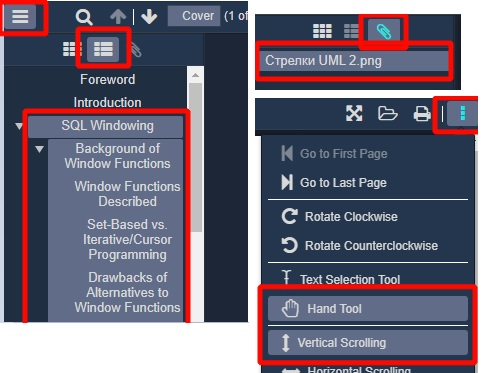
       </td>
    </tr>
    <tr>
      <td>--pdf-dialog-button-color</td>
      <td>.pdf-app .dialog .overlayButton</td>
      <td>
        
      </td>
    </tr>
    <tr>
      <td>--pdf-dialog-button-font-color</td>
      <td>.pdf-app .dialog .overlayButton</td>
      <td>
        
      </td>
    </tr>
    <tr>
      <td>--pdf-error-more-info-color</td>
      <td>.pdf-app #errorMoreInfo</td>
      <td>
        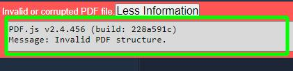      
      </td>
    </tr>
    <tr>
      <td>--pdf-error-more-info-font-color</td>
      <td>.pdf-app #errorMoreInfo</td>
      <td>
              
      </td>
    </tr>
    <tr>
      <td>--pdf-error-wrapper-color</td>
      <td>.pdf-app #errorWrapper</td>
      <td>
        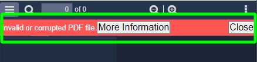      
      </td>
    </tr>
    <tr>
      <td>--pdf-find-input-placeholder-font-color</td>
      <td>.pdf-app #findInput::placeholder</td>
      <td>
        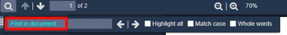      
      </td>
    </tr>
    <tr>
      <td>--pdf-find-message-font-color</td>
      <td>.pdf-app #findMsg</td>
      <td>
        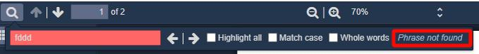      
      </td>
    </tr>
    <tr>
      <td>--pdf-find-results-count-color</td>
      <td>.pdf-app #findResultsCount</td>
      <td>
        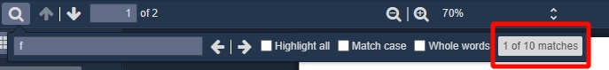      
      </td>
    </tr>
    <tr>
      <td>--pdf-find-results-count-font-color</td>
      <td>.pdf-app #findResultsCount</td>
      <td>
              
      </td>
    </tr>
    <tr>
      <td>--pdf-horizontal-toolbar-separator-color</td>
      <td>.pdf-app .horizontalToolbarSeparator</td>
      <td>
        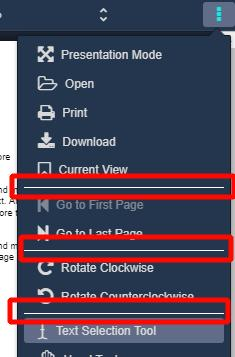      
      </td>
    </tr>
    <tr>
      <td>--pdf-input-color</td>
      <td>.pdf-app .toolbarField</td>
      <td>
        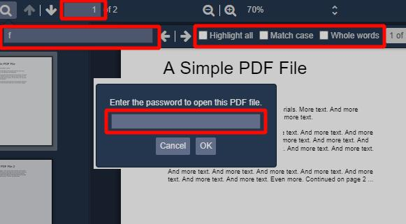      
      </td>
    </tr>
    <tr>
      <td>--pdf-input-font-color</td>
      <td>.pdf-app .toolbarField</td>
      <td>
              
      </td>
    </tr>
    <tr>
      <td>--pdf-loading-bar-color</td>
      <td>.pdf-app #loadingBar .progress</td>
      <td>
        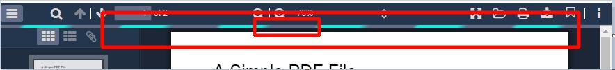      
      </td>
    </tr>
    <tr>
      <td>--pdf-loading-bar-secondary-color</td>
      <td>.pdf-app #loadingBar .progress.indeterminate .glimmer</td>
      <td>
        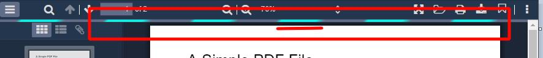      
      </td>
    </tr>
    <tr>
      <td>--pdf-not-found-color</td>
      <td>.pdf-app #findInput.notFound</td>
      <td>
        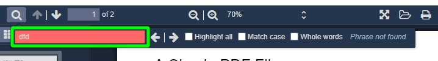      
      </td>
    </tr>
    <tr>
      <td>--pdf-overlay-container-color</td>
      <td>.pdf-app #overlayContainer</td>
      <td>Background color for overlay container of dialogs</td>
    </tr>
    <tr>
      <td>--pdf-overlay-container-dialog-color</td>
      <td>.pdf-app #overlayContainer > .container > .dialog</td>
      <td>
        Background color for document properties, password, print dialogs
      </td>
    </tr>
    <tr>
      <td>--pdf-overlay-container-dialog-font-color</td>
      <td>.pdf-app #overlayContainer > .container > .dialog</td>
      <td>
        Font color for document properties, password, print dialogs
      </td>
    </tr>
    <tr>
      <td>--pdf-overlay-container-dialog-separator-color</td>
      <td>.pdf-app .dialog .separator</td>
      <td>
        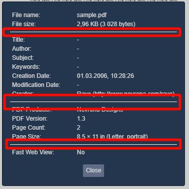      
      </td>
    </tr>
    <tr>
      <td>--pdf-sidebar-content-color</td>
      <td>.pdf-app #sidebarContent</td>
      <td>
        Background color for sidebar
      </td>
    </tr>
    <tr>
      <td>--pdf-split-toolbar-button-separator-color</td>
      <td>
        .pdf-app .splitToolbarButtonSeparator
        <hr>
        .pdf-app .verticalToolbarSeparator
      </td>
      <td>
        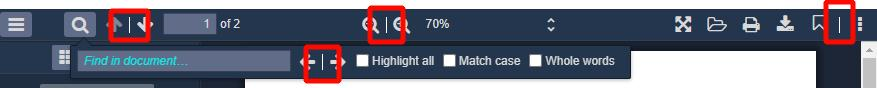      
      </td>
    </tr>
    <tr>
      <td>--pdf-thumbnail-selection-ring-selected-color</td>
      <td>.pdf-app .thumbnail.selected > .thumbnailSelectionRing</td>
      <td>
        Border color for selected thumbnail
        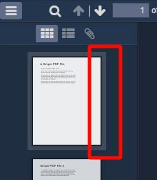
      </td>
    </tr>
    <tr>
      <td>--pdf-thumbnail-selection-ring-color</td>
      <td>
        .pdf-app a:focus > .thumbnail > .thumbnailSelectionRing
        <hr>
        .pdf-app .thumbnail:hover > .thumbnailSelectionRing
      </td>
      <td>
        Border color for thumbnail on hover and focus
        
      </td>
    </tr>
    <tr>
      <td>--pdf-toolbar-color</td>
      <td>
        .pdf-app #toolbarContainer
        <hr>
        .pdf-app .findbar
        <hr>
        .pdf-app .secondaryToolbar
        <hr>
        .pdf-app .doorHanger:after
        <hr>
        .pdf-app .doorHangerRight:after
        <hr>
        .pdf-app .dropdownToolbarButton > select
        <hr>
        .pdf-app .dropdownToolbarButton > select > option
      </td>
      <td>
        Background color for toolbar, findbar, secondary toolbar, page scale dropdown
      </td>
    </tr>
    <tr>
      <td>--pdf-toolbar-font-color</td>
      <td>
        .pdf-app .toolbarButton
        <hr>
        .pdf-app .dropdownToolbarButton
        <hr>
        .pdf-app .secondaryToolbarButton
        <hr>
        .pdf-app .dropdownToolbarButton > select
        <hr>
        .pdf-app .toolbarLabel
        <hr>
        .pdf-app .outlineItem > a
        <hr>
        .pdf-app .attachmentsItem > button
      </td>
      <td>
        Font color for toolbar, findbar, secondary toolbar, page scale dropdown, attachments name</td>
    </tr>
    <tr>
      <td>--pdf-toolbar-sidebar-color</td>
      <td>.pdf-app #toolbarSidebar</td>
      <td>
        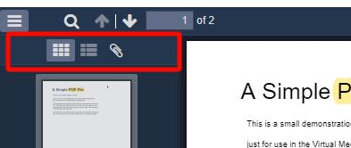
      </td>
    </tr>
  </table>
</details>

# Icons customization

To use default icons `import "vue-pdf-app/dist/icons/main.css";`.

To use custom icons you have to implement [icons.css](https://github.com/sandanat/vue-pdf-app/blob/master/src/sass/icons.scss):

```css
.vue-pdf-app-icon::before,
.vue-pdf-app-icon::after {
  font-family: "your font family";
}

.vue-pdf-app-icon.zoom-out::before {
  content: "icon code";
}
```

# Light/dark themes

<details>
<summary>Algorithm of theme apply</summary>
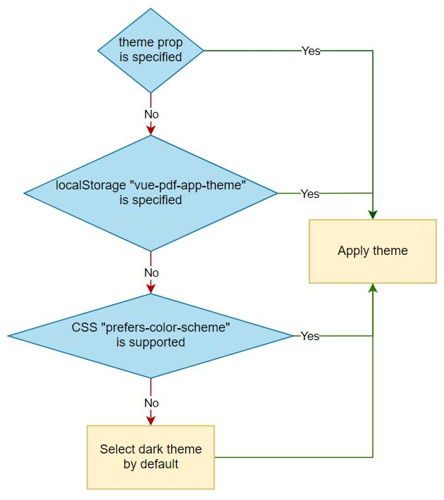
</details>

Toggle theme button is not implemented by default.
It's up to you to decide where to place it.
The button can be implemented with slots:

```vue
<vue-pdf-app>
  <template #footer="{ toggleTheme }">
    <button @click="toggleTheme" type="button">Toggle theme</button>
  </template>
</vue-pdf-app>
```

# Localized panel

English is the default language for panel.
Use `<link rel="resource" type="application/l10n" href="path-to-localization-file">` in your html for localization.
See [localization file examples](https://github.com/mozilla/pdf.js/tree/master/l10n "file examples").

# Examples

## Script tag (unpkg)

```html
<!DOCTYPE html>
<html lang="en">
  <head>
    <meta name="viewport" content="width=device-width, initial-scale=1.0" />
    <meta charset="utf-8" />
    <title>Vue-pdf-app demo</title>
    <link
      rel="stylesheet"
      href="https://unpkg.com/vue-pdf-app@2.0.0/dist/icons/main.css"
    />
    <script src="https://unpkg.com/vue"></script>
    <script src="https://unpkg.com/vue-pdf-app@2.0.0"></script>
    <style>
      body,
      html {
        padding: 0;
        margin: 0;
      }
    </style>
  </head>

  <body>
    <div id="app" style="height: 100vh;">
      <vue-pdf-app pdf="/sample.pdf"></vue-pdf-app>
    </div>
    <script>
      new Vue({
        components: {
          VuePdfApp: window["vue-pdf-app"]
        }
      }).$mount("#app");
    </script>
  </body>
</html>
```

## Typescript

```vue
<template>
  <div id="app">
    <vue-pdf-app pdf="/sample.pdf"></vue-pdf-app>
  </div>
</template>

<script lang="ts">
import "vue-pdf-app/dist/icons/main.css";
import VuePdfApp from "vue-pdf-app";
import { Component, Vue } from "vue-property-decorator";

@Component({
  components: {
    VuePdfApp
  }
})
export default class App extends Vue {}
</script>
```

## Lazy loading

PDFJS is a huge package (see the library size table above).
So use lazy loading to split your bundle into small pieces.

```vue
<template>
  <div id="app">
    <vue-pdf-app></vue-pdf-app>
  </div>
</template>

<script>
import "vue-pdf-app/dist/icons/main.css";
import Loader from "./components/Loader.vue";

export default {
  name: "App",
  components: {
    "vue-pdf-app": () => ({
      component: new Promise((res) => {
        return setTimeout(
          () => res(import(/* webpackChunkName: "pdf-viewer" */ "vue-pdf-app")),
          4000
        );
      }),
      loading: Loader
    })
  }
};
</script>
```

## PDFJS interaction

You can interact with pdfjs library when pdf is opened via `open` event.

```vue
<template>
  <div id="app">
    <div id="pdf-wrapper">
      <vue-pdf-app pdf="/sample.pdf" @open="openHandler"></vue-pdf-app>
    </div>
    <div id="info">
      <h1>PDF info:</h1>
      <div v-for="item in info" :key="item.name">
        <span>{{ item.name }}: {{ item.value }}</span>
        <br />
      </div>
    </div>
  </div>
</template>

<script>
import "vue-pdf-app/dist/icons/main.css";
import VuePdfApp from "vue-pdf-app";

export default {
  name: "App",
  components: {
    VuePdfApp
  },
  data() {
    return {
      info: []
    };
  },
  methods: {
    async openHandler(pdfApp) {
      this.info = [];
      const info = await pdfApp.pdfDocument
        .getMetadata()
        .catch(console.error.bind(console));

      if (!info) return;
      const props = Object.keys(info.info);
      props.forEach((prop) => {
        const obj = {
          name: prop,
          value: info.info[prop]
        };
        this.info.push(obj);
      });
    }
  }
};
</script>
```
